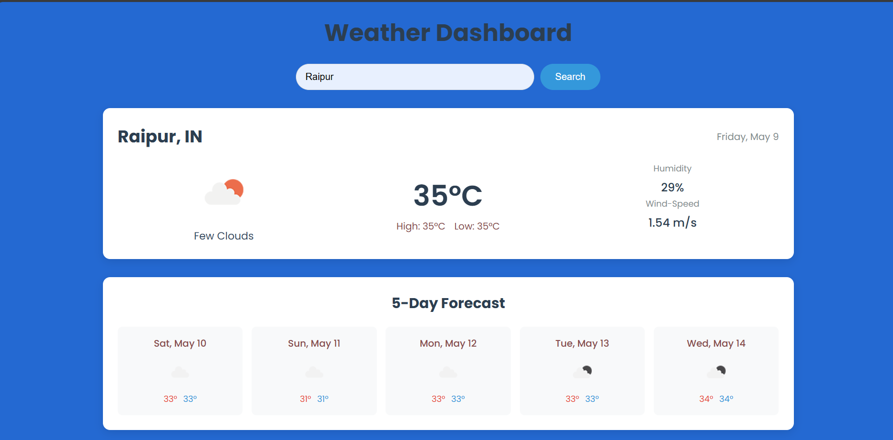
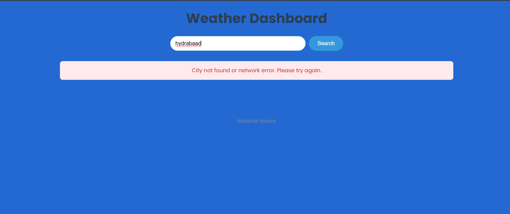
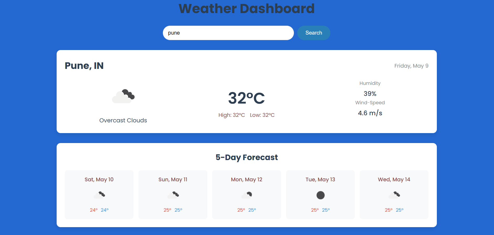

# Weather-Dashboard

A simple and responsive weather dashboard web application built using HTML, CSS, and vanilla JavaScript. This application allows users to search for a city and view the current weather along with a 5-day forecast.

## Features

- **Search Bar:** Easily search for weather information by entering a city name.
- **Current Weather:** Displays the city name, current temperature (in Celsius), weather condition icon and description, humidity, and wind speed.
- **5-Day Forecast:** Shows a 5-day weather forecast with the date (day of the week), weather condition icon, and high/low temperatures (in Celsius).
- **Loading Indicator:** Provides visual feedback to the user while weather data is being fetched.
- **Error Handling:** Gracefully handles cases where the city is invalid or there are network issues, displaying an informative error message.
- **Mobile-Responsive Design:** The layout adapts seamlessly to different screen sizes (mobile, tablet, desktop) using responsive CSS.
- **Clean and Modular Code:** The codebase is well-commented and organized into separate functions for better readability and maintainability.
- **No Frameworks or Libraries:** Built using only standard HTML, CSS, and vanilla JavaScript.

## Technologies Used

- HTML5
- CSS3
- Vanilla JavaScript

## ScreenShots


### Raipur-Weather



### Error-Message



### Pune-Weather



## Setup

1.  **Download the files:** Ensure you have the `index.html`, `styles.css`, and `script.js` files in the same directory.
2.  **Open `index.html` in your web browser:** The dashboard should load.
3.  **Add your OpenWeatherMap API Key:**
    - Open the `script.js` file.
    - Locate the line:
      ```javascript
      const apiKey = 'YOUR_OPENWEATHERMAP_API_KEY'; // Replace with your actual API key
      ```
    - Replace `'YOUR_OPENWEATHERMAP_API_KEY'` with your actual API key from [OpenWeatherMap](https://openweathermap.org/). You'll need to sign up for a free account to get an API key.

## How to Use

1.  Enter the name of a city in the search bar at the top of the page.
2.  Click the "Search" button or press the Enter key.
3.  The dashboard will display the current weather information for the entered city, along with a 5-day forecast below.
4.  If there are any errors (e.g., invalid city name, network issues), an error message will be displayed.

## Project Structure
├── index.html<br>
├── script.js<br>
├── styles.css<br>
├── ScreenShot<br>
└── README.md

